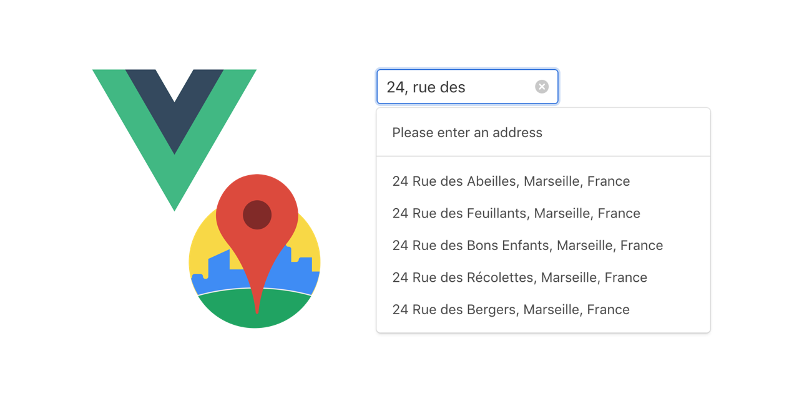
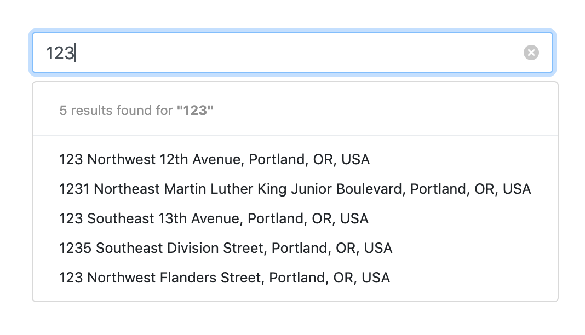

# vue-custom-google-autocomplete

<p align="center">
  
</p>

## Installation

You need [Vue.js](https://vuejs.org/) **version 2.0+** and an [Google PLACE API](https://developers.google.com/places/web-service/get-api-key) key. This plugin is a renderless component. It comes without any css as the main goal is to use it with differents frameworks. 

If you looking for framework oriented components, you can import them separately (see ***pre-configured*** section)
PR are welcome for other components

### Install via npm

```bash
npm install vue-custom-google-autocomplete
yarn add vue-custom-google-autocomplete
```

### Import and use

Note: if you want a specific preconfigured component, skit this step and import it as a simple component (see ***pre-configured*** section)

```javascript
import Vue from 'vue'
import CustomGoogleAutocomplete from 'vue-custom-google-autocomplete'

...

Vue.use(CustomGoogleAutocomplete)
```

```vue
<template>
  <custom-google-autocomplete :options="options" @select="$emit('select', $event)")
    <div slot-scope="{ inputAttrs, inputEvents, loading, results, query, selectPrediction, hasResults }">
    	...
    </div>
  </custom-google-autocomplete>
</template>
```


## Props

| Name          | Type    | Default                                         | Description                                            |
|---------------|---------|-------------------------------------------------|--------------------------------------------------------|
| `options`     | Object  | see options section                             | Plugin options (see options section)                   |
| `value`       | String  | null                                            | Input value (can be use with v-model)                  |

You can also pass all props available on an input (placeholder, name..)

## Options

```javascript
options = {
  apiKey: YOUR_API_KEY,
  deepSearch: true,
  cors: false,
  params: {},
  focus: false
}
```

| Name                 | Type    | Default                      | Description                                                            |
|----------------------|---------|------------------------------|------------------------------------------------------------------------|
| `apiKey`             | String  | null                         | Your Google PLACE Api key (REQUIRED)                                   |
| `deepSearch`         | Boolean | true                         | Get more informations about selected place (geometry etc..)            |
| `cors`               | Boolean | false                        | Set to true when project is running locally                            |
| `params`             | Object  | {}                           | Google Autocomplete optional parameters                                |
| `focus`              | Boolean | false                        | Focus input                                                            |
| `debounceTime`       | Number  | 400                          | Time in ms before trigger a new Google api call                        |

Params object is useful to refine predictions, for example if you want to get first predictions near to a location within a radius distance in a certain language you can set params like this :

```javascript
params = {
  location: `${lat},${lng}`,
  radius: 1000,
  language: 'fr'
}
```
See [Optional parameters](https://developers.google.com/places/web-service/autocomplete) section for more informations

## Events

@select event is triggered when a prediction is selected. It send an object with datas about the location

## Template and slot-scope

In order to be more flexbile, you are able to make your own results template with `slot-scope`.

```javascript
props = {
  inputAttrs: Object,
  inputEvents: Object,
  query: String,
  results: Array,
  loading: Boolean,
  selectPrediction: Function,
  hasResults: Boolean
}
```

## Pre-configured Components


### Bulma dropdown markup.


```vue
<template>
  <bulma-dropdown(:options="options" @select="selected = $event") placeholder="Search"/>
</template>

<script>
import { BulmaDropdown } from 'vue-custom-google-autocomplete'

export default {
  components: {
    BulmaDropdown
  },
  data() {
    return {
      selected: null,
      options: {
        apiKey: process.env.VUE_APP_PLACE_API_KEY,
        deepSearch: true,
        cors: true,
        focus: false,
        params: {
          location: '43.3,5.4',
          radius: 1000,
          language: 'fr'
        }
      }
    }
  }
}
</script>
```

To customize loading text and no results text, two slots are availables : `loading` and `empty`.
Input is binded with `$attrs`


### Bootstrap dropdown.



```vue
<template>
  <bootstrap-dropdown(:options="options" @select="selected = $event") name="input-name"/>
</template>

<script>
import { BootstrapDropdown } from 'vue-custom-google-autocomplete'
export default {
  components: {
    BootstrapDropdown
  },
  data() {
    return {
      selected: null,
      options: any = {
        apiKey: process.env.VUE_APP_PLACE_API_KEY,
        deepSearch: true,
        cors: true,
        focus: false,
        params: {
          location: '45.52345,-122.67621',
          radius: 1000,
          language: 'en'
        }
      }
    }
  }
}
</script>
```

To customize loading text and no results text, two slots are availables : `loading` and `empty`.
Input is binded with `$attrs`
